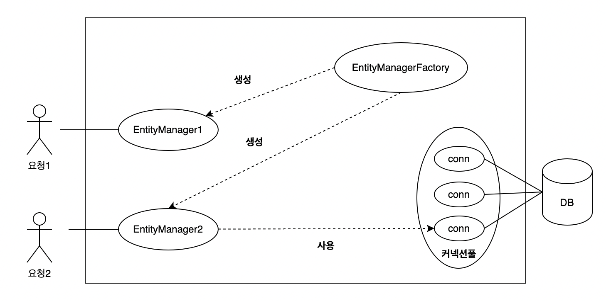

# 3.1 엔티티 매니저 팩토리와 엔티티 매니저

### 엔티티 매니저 팩토리 
이름 그대로 엔티티 매니저를 만드는 공장 
엔티티 매니저 팩토리를 만드는 비용은 상당히 크다.  
따라서, 한 개만 만들어서 애플리케이션 전체에서 공유하도록 설계 되어 있다.  
여러 스레드가 동시에 접근해도 안전하다. 

### 엔티티 매니저 
여러 스레드가 동시에 접근하면 동시성 문제가 발생하기 때문에 스레드 간 절대 공유하면 안된다. 

엔티티 매니저 팩토리와 엔티티 매니저가 동작하는 과정을 그림으로 나타내면 아래와 같다. 

- EntityManagerFactory 에서 다수의 엔티티 매니저를 생성한다. 
- EntityManager1 은 아직 데이터베이스 커넥션을 사용하지 않는데, 엔티티 매니저의 경우 DB 가 필요한 시점까지 커넥션을 얻지 않는다. (보통 트랜잭션 시작 시 커넥션을 획득한다)
- 보통 J2S3 환경에서 JPA 구현체들은 EntityManagerFactory 를 생성할 때 커넥션풀도 생성한다. 

