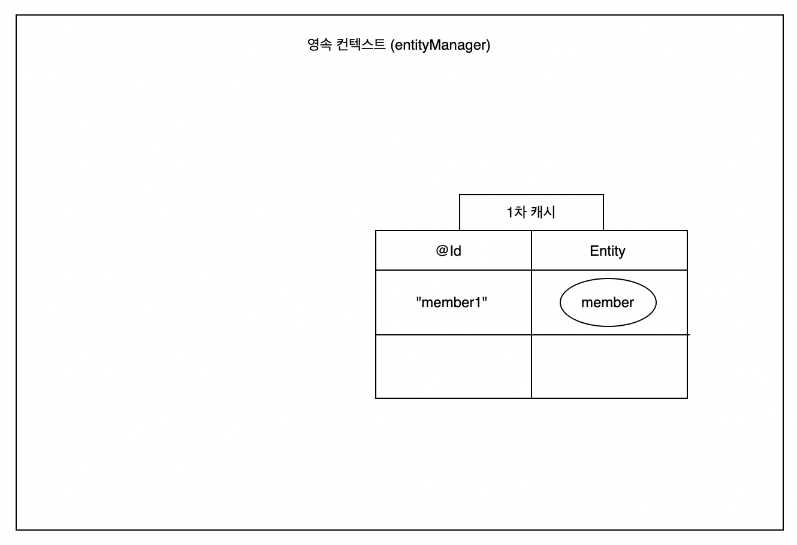
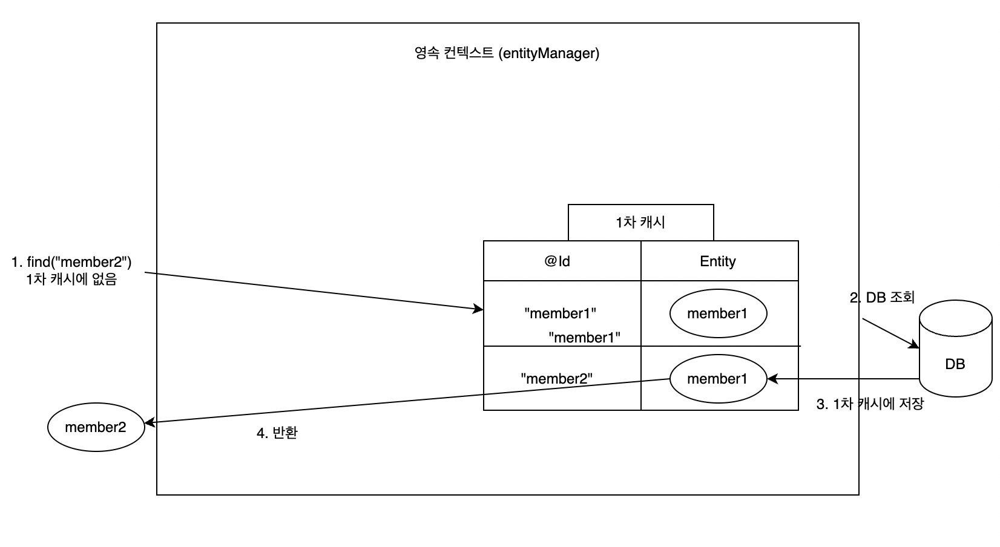
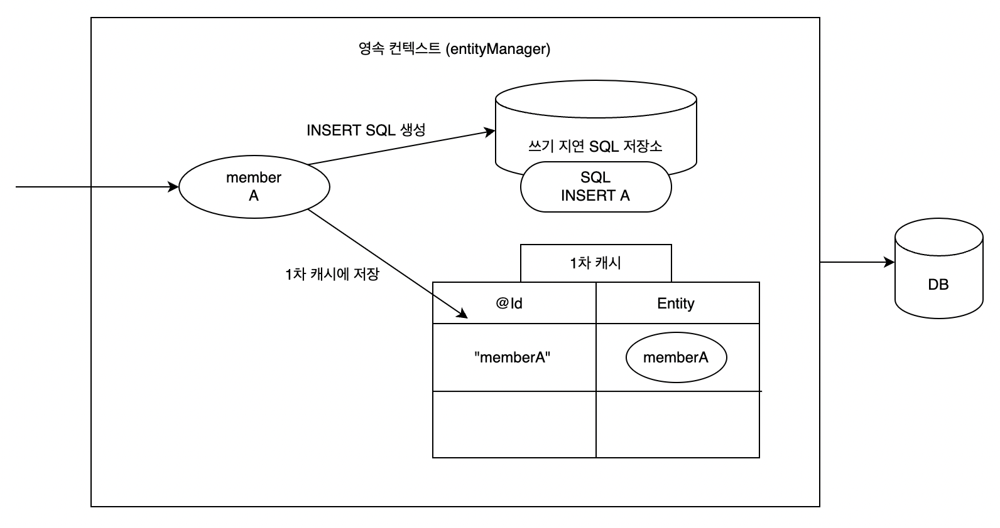
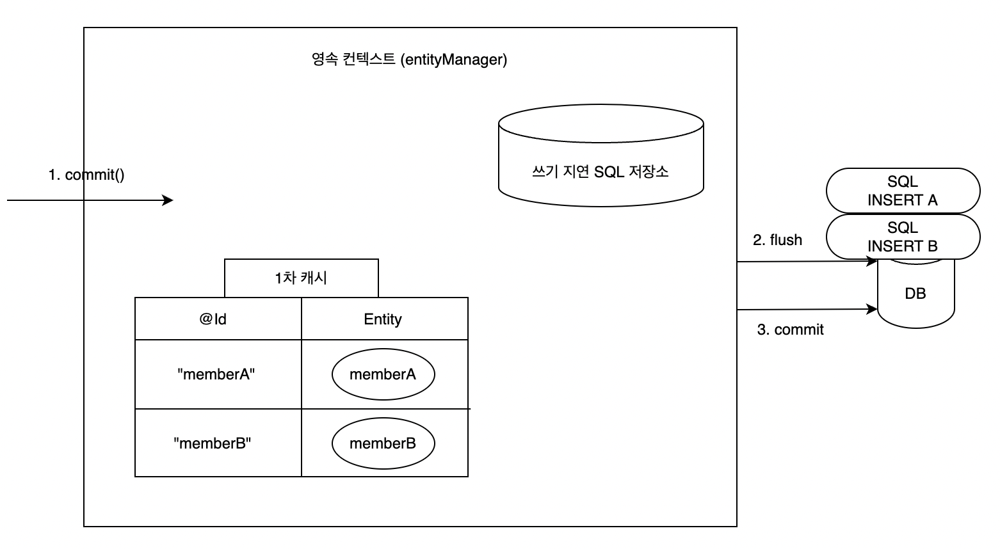
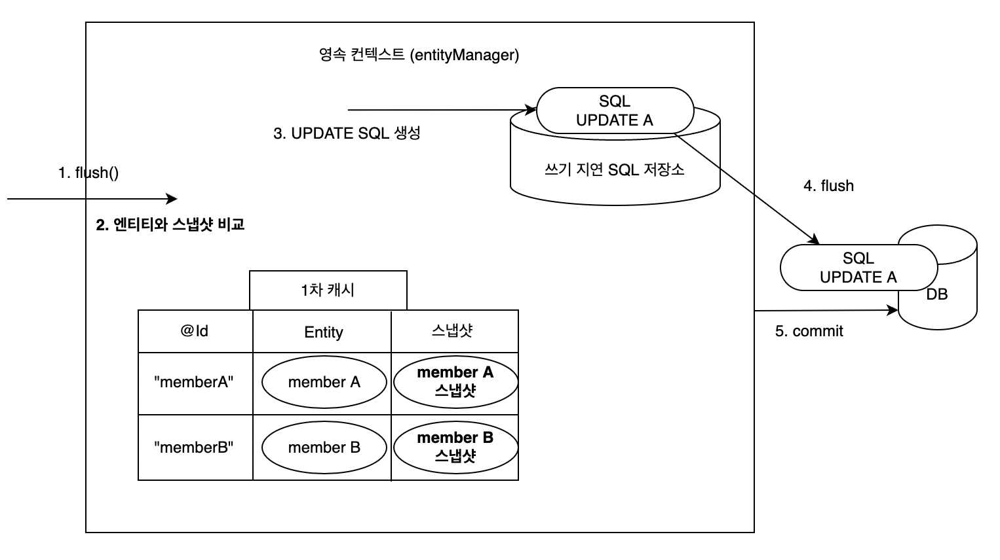

# 3.4 영속성 컨텍스트의 특징

### 영속성 컨텍스트의 식별자 값
- 영속성 컨텍스트는 엔티티를 식별자 값(@Id로 테이블의 기본 키와 매핑한 값) 으로 구분한다 
- 그렇기 때문에 영속 상태는 식별자 값이 반드시 있어야 한다. 아니면 예외 발생 !!

### 영속성 컨텍스트와 데이터베이스 저장
- JPA 는 보통 트랜잭션을 커밋하는 순간 영속성 컨텍스트에 새로 저장된 엔티티를 DB 에 반영한다. -> 플러시 (flush)

### 영속성 컨텍스트가 엔티티를 관리했을 때 장점
- 1차 캐시
- 동일성 보장 
- 지연 로딩 
- 변경 감지 
- 트랜잭션을 지웒는 쓰기 지연

## 엔티티 조회 (R)
영속성 컨텍스트는 내부에 캐시를 가지고 있는데 이것은 1차 캐시라고 한다.<br>
영속 상태의 엔티티는 모두 이곳에 저장된다.<br>
영속성 컨텍스트 내부에 Map 이 있는데 키는 @Id 로 매핑한 식별자고, 값은 엔티티 인스턴스다. 

```java
// 엔티티를 생성한 상태 (비영속)
Member member = new Member();
member.setId("member1");
member.setUsername("회원1");

// 엔티티 영속
em.persist(member);
```



엔티티를 조회해보자. 
```java 
Member member = em.find(Member.class, "member1");
```
find() 메소드를 보면 첫 번째 파라미터는 엔티티 클래스의 타입이고, 두 번째는 조회할 엔티티의 식별자 값이다.<br>
em.find() 를 호출하면 먼저 1차 캐시에서 엔티티를 찾고 만약 찾는 엔티티가 1차 캐시에 없으면 DB에서 조회한다. 

### 1차 캐시에서 조회
1. em.find() 를 호출하면 우선 1차 캐시에서 식별자 값으로 엔티티를 찾는다. 
2. 엔티티가 있으면 데이터베이스를 조회하지 않고 메모리에 있는 1차 캐시에서 엔티티를 조회한다. 


```java
Member member = new Member();
member.setId("member1");
member.setUsername("회원1");

em.persist(member);

Member findMember = em.find(Member.class, "member1");
```

### DB 에서 조회
em.find() 를 호출했는데 엔티티가 1차 캐시에 없으면 엔티티 매니저는 DB 를 조회해서 엔티티를 생성한다. 


1. em.find(Member.class, "member2") 를 실행한다. 
2. member2 가 1차 캐시에 없으므로 DB 에서 조회한다. 
3. 조회한 데이터로 member2 엔티티를 생성해서 1차 캐시에 저장한다. (영속상태)
4. 조회한 엔티티를 반환한다. 

1차 캐시에 엔티티가 있는 경우 메모리에 있는 캐시에서 바로 불러오기 때문에 성능상 이점을 누릴 수 있다. 

### 영속 엔티티의 동일성 보장 
```java
Member a = em.find(Member.class, "member1");
Member b = em.find(Member.class, "member2");

System.out.println(a == b); // 동일성 비교 
```

`em.find(Member.class, "member1");` 를 반복해서 호출해도 영속성 컨텍스트는 1차 캐시에 있는 같은 엔티티 인스턴스를 반환한다.<br>
그렇기 때문에 둘은 같은 인스턴스이고, 결과는 당연히 참이다. 

> **동일성 동등성** <br>
동일성 : 실제 인스턴스가 같다. 따라서 참조 값을 비교하는 == 비교 값이 같다.<br>
동등성 : 실제 인스턴스는 다를 수 있지만, 인스턴스가 가지고 있는 값이 같다. 자바에서 동등성 비교는 equlas() 메소드를 구현해야 한다. 

> JPA 는 1차 캐시를 통해 **REPEATABLE READ** 등급의 트랜잭션 격리 수준을 DB 가 아닌 어플리케이션 차원에서 제공한다는 장점이 있다. 

## 엔티티 등록 (C)
```java
EntityManager em = emf.createEntityManager();
EntityTrasaction transaction = em.getTransaction();
// 엔티티 매니저는 데이터 변경 시 트랜잭션을 시작해야 한다. 
transaction.begin(); // [트랜잭션] 시작 

em.persist(memberA);
em.persist(memberB);
// 여기까지 INSERT SQL 을 DB 에 보내지 않는다. 

// 커밋하는 순간 DB 에 INSERT SQL 을 보낸다. 
transaction.commit(); // [트랜잭션] 커밋
```

1. 엔티티 매니저는 트랜잭션을 커밋하기 직전까지 DB에 엔티티를 저장하지 않고, 내부 쿼리 저장소에 INSERT SQL 을 차곡차곡 모은다. 
2. 트랜잭션을 커밋할 때 모아둔 쿼리를 DB 에 보낸다. (트랜잭션을 지원하는 쓰기 지연)



먼저 회원 A 를 영속화 하고, 영속성 컨텍스트는 1차 캐시에 회원 엔티티를 저장하면서 동시에 회원 엔티티 정보를 등록 쿼리로 만든다.<br>그리고 만든 쿼리를 쓰기 지연 SQL 저장소에 보관한다. 


다음으로 회원 B 를 영속화했다. 마찬가지로 회원 엔티티 정보로 등록 쿼리를 생성해서 쓰기 지연 SQL 저장소에 보관한다.<br>
현재 쓰기 지연 SQL 저장소에는 등록 쿼리가 2건 등록되어 있다. 


마지막으로 트랜잭션을 커밋한다. <br>
트랜잭션을 커밋하면 엔티티 매니저는 우선 영속성 컨텍스트를 플러시한다.<br>
이때 등록, 수정, 삭제한 엔티티를 DB 에 반영한다.<br>
쓰기 지연 SQL 저장소에 모인 쿼리를 DB 에 보낸다<br>
영속성 컨텍스트의 변경 내용을 DB 에 동기화한 후 실제 DB 트래잭션을 동기화한다. 

### 트랜잭션을 지원하는 쓰기 지연이 가능한 이유 
```java
begin(); // 트랜잭션 시작 

save(A);
save(B);
save(C);

commit(); // 트랜잭션 커밋
```
1. 데이터를 저장하는 즉시 등록 쿼리를 DB 에 보낸다. <br>
save() 메소드를 호출할 때마다 즉시 DB 에 등록 쿼리를 보낸다. <br>
마지막에 트랜잭션을 커밋한다. 

2. 데이터를 저장하면 등록 쿼리를 DB 에 보내지 않고, 메모리에 모아둔다.<br>
트랜잭션을 커밋할 때 모아둔 등록 쿼리를 DB 에 보낸 후에 커밋한다. 

트랜잭션 범위 내에서 실행되기 때문에 둘의 결과는 같다.<br>
1번의 경우도 트랜잭션을 커밋하지 않으면 아무 소용이 없다.<br>
어떻게 하든 커밋 직전에만 DB에 SQL 을 전달하면 된다. 그렇기 때문에 트랜잭션을 지원한 쓰기 지연이 가능하다. 

## 엔티티 수정 (U)
### SQL 수정 쿼리의 문제점 
SQL 을 사용하면 수정 쿼리를 직접 작성해야 한다. 그런데 프로젝트가 점점 커지고 요구사항이 늘어나면서 수정 쿼리도 점점 추가된다. 

다음은 회원의 이름, 나이를 변경하는 SQL이다. 
```sql
UPDATE MEMBER 
SET NAME = ?, AGE = ?
WHERE id = ?
```

여기에 회원의 등급을 변경하는 기능이 추가되면 수정 쿼리를 추가로 작성해야 한다. 
```sql
UPDATE MEMBER
SET GRADE = ?
WHERE id = ?
```

보통은 이렇게 2개의 수정 쿼리를 작성하거나, 둘을 합쳐서 하나의 수정 쿼리만 사용해도 된다. 

하지만 합친 쿼리를 사용했을 때 실수로 데이터를 입력하지 않을 수 있다. 
결국 부담스러운 상황을 피가히 위해서는 수정 쿼리를 계속해서 추가해줄 수 밖에 없는데, 이런 개발 방식의 문제점은 
1. 수정 쿼리가 많아지고 
2. 비즈니스 로직을 분석하기 위해 SQL 을 계속 확인해야 하고,
3. 결국 직간접적으로 비즈니스 로직이 SQL 에 의존하게 된다. 

### 변경 감지 
```java
EntityManager em = emf.createEntityManager();
EntityTransaction transaction = em.getTransaction();
transaction.begin(); // [트랜잭션] 시작

// 영속 엔티티 조회 
Member memberA = em.find(Member.class, "memberA");

// 영속 엔티티 데이터 수정 
memberA.setUsername("hi");
memberA.setAge(10);

transaction.commit(); // [트랜잭션] 커밋
```

em.update() 메소드를 실행해야 할 것 같지만, JPA 에 이러한 메소드는 없다. 엔티티 데이터만 변경했는데 어떻게 DB 에 반영이 될까 ? 

엔티티의 변경사항을 DB 에 자동으로 변경하는 기능을 **변경 감지**라고 한다. 



1. 트랜잭션을 커밋하면 엔티티 매니저 내부에서 먼저 플러시가 호출된다. 
2. 엔티티와 스냅샷을 비교해서 변경된 엔티티를 찾는다. 
3. 변경된 엔티티가 있으면 수정 쿼리를 생성해서 쓰기 지연 SQL 저장소에 보낸다. 
4. 쓰기 지연 저장소의 SQL을 DB 에 보낸다
5. DB 트랜잭션을 커밋한다. 

**변경 감지는 영속성 컨텍스트가 관리하는 영속 상태의 엔티티에만 적용된다**<br>
영속성 컨텍스트의 고나리를 받지 못하는 엔티티는 값을 변경해도 DB 에 반영되지 않는다. 

JPA 에선 UPDATE 문을 만들 때 엔티티의 모든 필드를 업데이트한다. 
```sql
UPDATE MEMBER
SET NAME = ?, AGE = ?, GRADE = ? ...
WHERE id = ?
```

데이터 전송량이 증가하는 단점이 있지만 

- 모든 필드를 사용하면 수정 쿼리가 항상 같다. 그렇기 때문에 어플리케이션 로딩 시점에 수정 쿼리를 미리 생성해두고 재사용할 수 있다. 
- DB에 동일한 쿼리를 보내면 DB는 이전에 한 번 파싱된 쿼리를 재사용할 수 있다. 

필드가 많거나 저장되는 내용이 너무 크면 수정된 데이터만 사용해서 동적으로 UPDATE SQL 을 생성하도록 하면 된다. 

➡️ org.hibernate.annotations.DynamicUpdate <br>
해당 어노테이션을 사용하면 수정된 데이터만 사용해서 동적으로 UPDATE SQL 을 생성한다. 

## 엔티티 삭제 
엔티티를 삭제하려면 먼저 삭제 대상 엔티티를 조회해야 한다. 
```java
// 삭제 대상 엔티티 조회 
Member memberA = em.find(Member.class, "memberA"); 
em.remove(memberA);
```

엔티티를 즉시 삭제하는 게 아니라 엔티티 등록과 비슷하게 삭제 쿼리를 쓰기 지연 SQL 저장소에 등록한다. 
이후 트랜잭션을 커밋해서 플러시를 호출하면 실제 DB 에 삭제 쿼리를 전달한다. 


